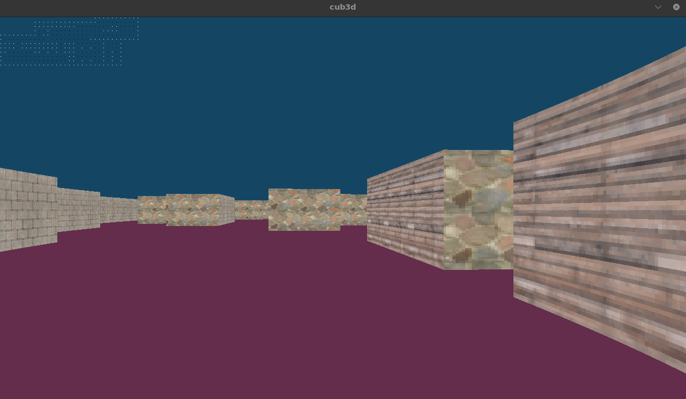
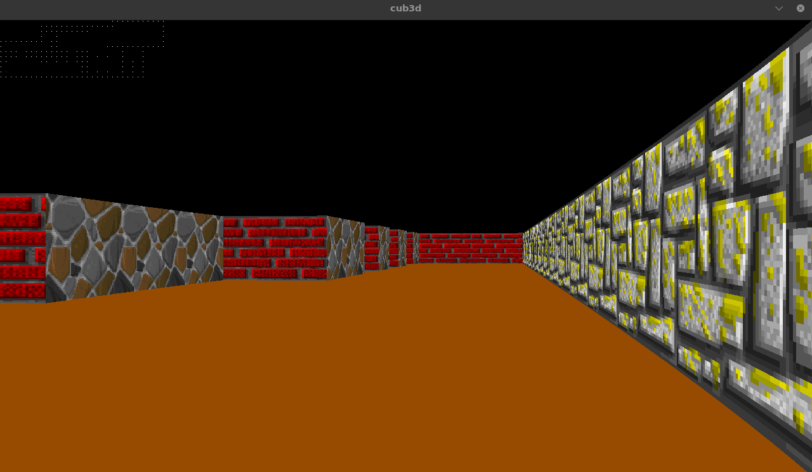

# 🧱 cub3D

A graphical programming project developed as part of the **42 School curriculum**, focused on building a simple **3D game engine** using **raycasting techniques** inspired by classic games like *Wolfenstein 3D*.




---

## 📖 Overview

**cub3D** is a real-time rendering project where a **2D map is transformed into a 3D first-person perspective** using mathematical techniques. The program simulates a maze environment that the player can explore interactively.

The project emphasizes:

* Building a pseudo-3D engine from scratch
* Understanding raycasting and rendering pipelines
* Working with low-level graphics libraries
* Parsing structured configuration files

The engine renders a first-person view of a maze using raycasting, a technique that simulates depth by projecting rays into a 2D map.

---

## 🧠 Learning Objectives

By completing this project, you will gain experience with:

* Raycasting and 2.5D rendering
* Trigonometry in graphics programming
* Window management and pixel drawing
* Event handling (keyboard/mouse)
* Parsing and validating configuration files
* Performance optimization for real-time rendering

---

## 📂 Project Structure

Typical components include:

* Rendering engine (raycasting logic)
* Map parsing and validation
* Player movement and controls
* Texture loading and drawing

---

## 🎮 Program Behavior

The program launches a graphical window displaying a 3D maze:

```bash id="cbrun1"
./cub3D map.cub
```

* Loads a `.cub` configuration file
* Parses textures, colors, and map layout
* Renders a first-person view of the maze
* Allows real-time navigation

---

## 🧩 How It Works

The core of the project is based on **raycasting**:

### 1. Map Representation

* A 2D grid defines walls and empty spaces
* Player position and direction are initialized

---

### 2. Raycasting Engine

* Rays are cast from the player’s viewpoint
* Each ray detects the distance to the nearest wall
* Distance determines wall height on screen

---

### 3. Projection

* Convert 2D ray distances into vertical wall slices
* Creates illusion of depth (pseudo-3D)

---

### 4. Texture Mapping

* Apply textures to walls based on hit position
* Enhances realism and immersion

---

### 5. Rendering Loop

* Continuously redraw scene
* Update player position and orientation

Raycasting allows a 3D-like environment to be rendered efficiently from a 2D map.

---

## 🗺️ Map Format (`.cub`)

The program uses a configuration file describing:

### 🔹 Elements

* Resolution (optional depending on subject)
* Texture paths (north, south, east, west walls)
* Floor and ceiling colors
* Map layout

### 🔹 Example

```text id="cbmap1"
NO ./textures/north.xpm
SO ./textures/south.xpm
WE ./textures/west.xpm
EA ./textures/east.xpm
F 220,100,0
C 225,30,0

111111
100001
1000N1
111111
```

The map must be **closed** and contain exactly one player position.

---

## 🎮 Controls

Typical controls include:

| Input           | Action        |
| --------------- | ------------- |
| `W / A / S / D` | Move player   |
| Arrow keys      | Rotate camera |
| `ESC`           | Exit program  |

Movement and rotation simulate a real first-person experience.

---

## ⚙️ Compilation & Usage

### Requirements

* make
* C compiler
* X11 display server

### To build the project

```bash id="cbbuild1"
make
```

### Cleaning

```bash id="cbclean1"
make clean      # Remove object files
make fclean     # Remove object files + binary
make re         # Rebuild everything
```

---

## 🚀 How to Use

```bash id="cbrun2"
./cub3D maps/example.cub
```

---

## 🌟 Bonus Features (Optional)

Depending on implementation:

* Minimap display
* Sprites (enemies, objects)
* Mouse-based camera control
* Screenshot export (`.bmp`)
* Animated textures or doors

---

## 📌 Constraints

* Must use **MiniLibX** for graphics
* No external game engines allowed
* Must handle:

  * Window events
  * Input correctly
  * Memory leaks
* Must validate `.cub` file thoroughly

---

## 🎯 Key Concepts Covered

| Category           | Topics                |
| ------------------ | --------------------- |
| Graphics           | Raycasting, rendering |
| Mathematics        | Trigonometry, vectors |
| System Programming | Event handling        |
| Parsing            | File validation       |
| Optimization       | Real-time performance |

---

## 🚀 Purpose of the Project

The **cub3D** project is designed to:

* Introduce 3D rendering concepts
* Demonstrate how early 3D engines worked
* Strengthen mathematical and graphical thinking
* Build complex interactive applications in C

---

## ⚠️ Notes

* This is a **2.5D engine**, not true 3D
* Precision and floating-point math are critical
* Performance optimization is essential for smooth rendering
* Map validation is a major source of bugs

---

## 🤝 Contributing

Contributions and improvements are welcome!

1. Fork the repository
2. Create a feature branch
3. Submit a pull request

---

## 📄 License

This project is for educational purposes.
Refer to the repository for licensing details (if provided).

---

## 📚 Resources

To deepen your understanding:

* Raycasting tutorials
* MiniLibX documentation
* Trigonometry in graphics programming
* Classic game engines (Wolfenstein 3D)

---
